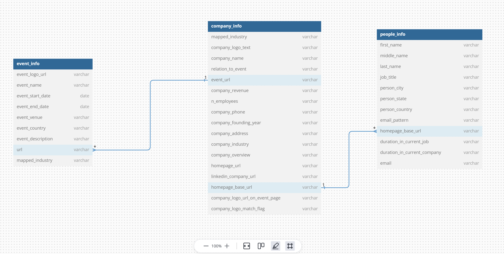

## Schema

## Key Challenges
As mentioned earlier in the python code, a lot of time was consumed for making the csv seedable. I had to seed many times, after finding out there were issues in the database, 
at first there were some issue querying data related to dates.

## Improvements
1. I added a mapped_industry colun to both, company_info and event_info, I feel like there should have been a seperate table to hold industry mappings.
2. Also, all the tables should have been related to each other using good primary keys. Using home_base_url and event_url isn't something you would do in production.
3. Also, would prefer to have id's for each entity in each table, which could be used for making relations via primary keys.
4. I feel like, if I had more time, I could have looked further into Normalization related information to make queries faster.